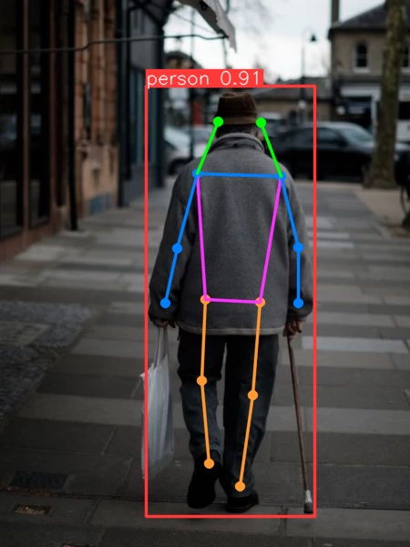

# Human Detection and Pose Recognition using Deep Learning  

## 📌 Project Overview  
This project focuses on human detection and pose classification using deep learning techniques.  
The workflow combines YOLOv8 for human detection, CNN for pose classification, and OpenCV-based keypoint extraction for pose estimation.  

The study includes:  
1. Dataset creation and annotation of human poses.  
2. Training a custom Convolutional Neural Network (CNN) for pose classification.  
3. Using YOLOv8 for human detection in images.  
4. Applying pose estimation models to extract body keypoints.  
5. Classifying human states (walking, sitting, standing, leaning, drinking).  

---

## 🎯 Objectives  
- Build a dataset of labeled human images.  
- Train a CNN model to classify human poses into 5 categories.  
- Detect humans in images using YOLOv8.  
- Apply pose estimation to identify body keypoints.  
- Validate classification and detection performance.  

---

## 🛠 Tools & Software  
- TensorFlow/Keras – CNN model training.  
- YOLOv8 (Ultralytics) – Human detection and pose estimation.  
- OpenCV – Image preprocessing, annotation, and visualization.  
- Pandas & NumPy – Data handling and processing.  
- Matplotlib – Plotting results.  

---

## 📐 Methodology  

### 1. Dataset Preparation  
- Collected ~300 images of humans in different poses.  
- Annotated bounding boxes and pose labels using Image Annotator.  
- Labels exported in JSON format.  
- Images resized to 28×28 for CNN training.  

### 2. CNN Model Training  
- Input: (28×28×3) RGB images.  
- Layers:  
  - Conv2D → MaxPooling → Conv2D → MaxPooling → Flatten.  
  - Dense (64 neurons, ReLU) → Dense (5 neurons, Softmax).  
- Trained for 50 epochs with categorical cross-entropy loss.  
- Achieved reliable classification for 5 human poses.  

### 3. Human Detection (YOLOv8)  
- Pretrained YOLOv8 model used for detecting humans.  
- Bounding boxes drawn with confidence score threshold = 0.3.  
- Number of detected persons displayed on the output image.  

### 4. Pose Classification  
- CNN model predicts poses among:  
  - Walking, Sitting, Standing, Leaning, Drinking.  
- Predictions mapped from numeric labels to string labels.  

### 5. Pose Estimation with Keypoints  
- Used YOLOv8n-pose and OpenCV DNN models for skeleton-based pose estimation.  
- Keypoints extracted: Neck, Shoulders, Elbows, Wrists, Hips, Knees, Ankles, Nose, Eyes, Ears.  
- Lines drawn between pairs of connected joints (skeleton visualization).  

---

## 📊 Results  
- CNN successfully classified human poses into 5 categories.  
- YOLOv8 detected multiple humans in images with high confidence.  
- Pose estimation provided detailed skeleton mapping of body joints.  
- Final system combined detection + classification + skeleton-based keypoint analysis.  

### Simulation Outputs  
-   

---

## 📂 Repository Structure

├── dataset/ # Collected and annotated dataset

├── models/ # Trained CNN and YOLO models

├── images/ # Example outputs (detection, classification, skeletons)

├── src/ # Python source codes (training, detection, pose estimation)

└── README.md # This file

---

## 🔬 Applications  
- Surveillance and security systems.  
- Sports analytics and motion tracking.  
- Human-computer interaction (HCI).  
- Healthcare monitoring (posture detection).  

---

## 👨‍🎓 Author  
- Mohammad Mahdi Khademi  
- Negar Naghavian

Supervised by: Dr. Seyed Hassan Zabihifar 

Course: Artificial Intelligence 

---

## 📖 References  
- TensorFlow & Keras Documentation.  
- Ultralytics YOLOv8 Documentation.  
- OpenCV Pose Estimation Tutorials.  
- Course lecture notes on CNNs and Human Detection.